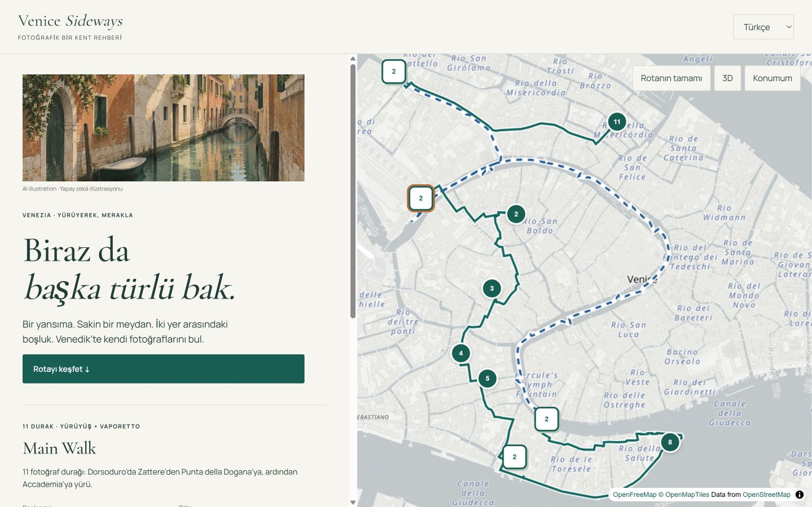
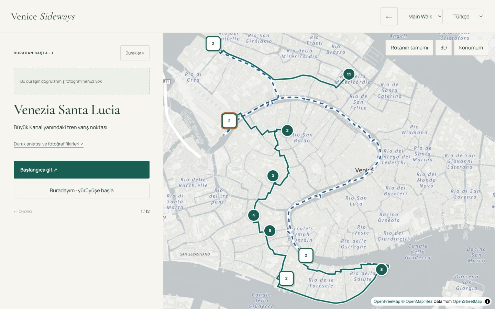
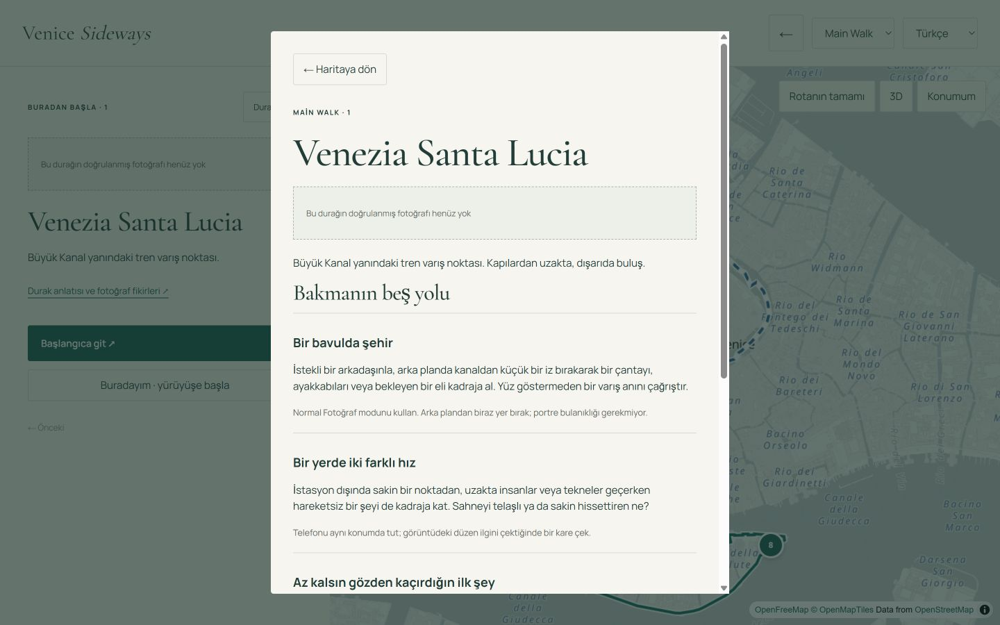
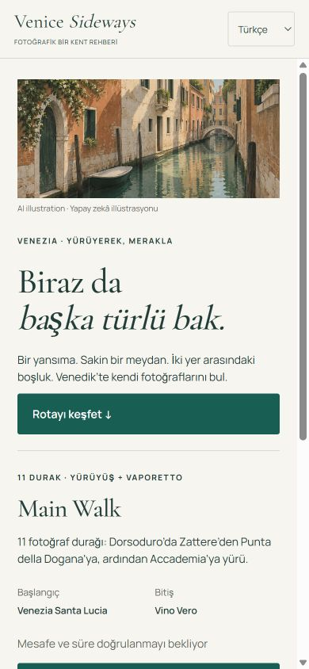
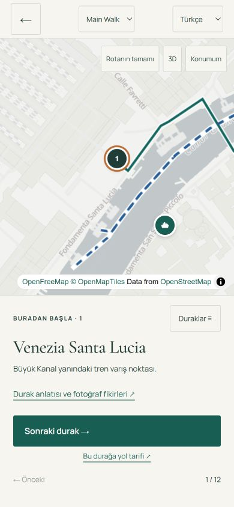
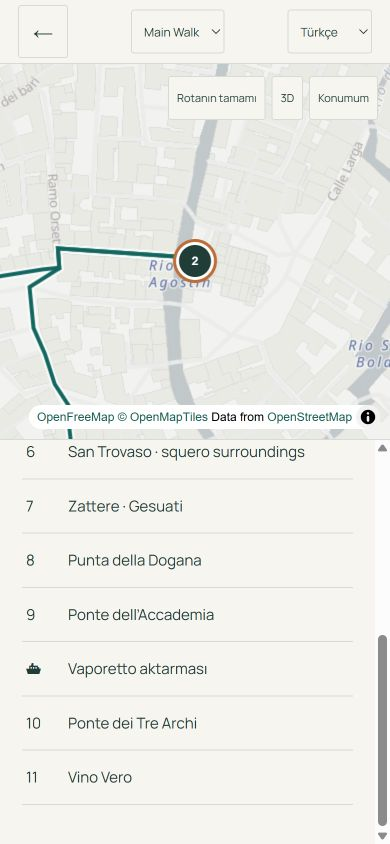
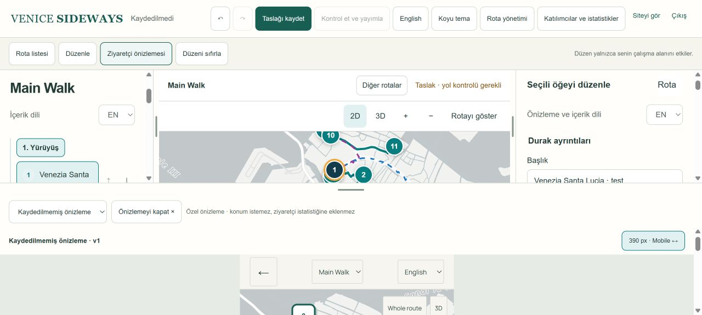
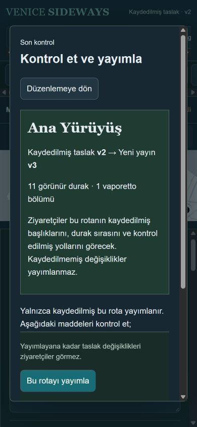

# Venice Sideways — tasarım ve doğrulama notu

28 Eylül 2026. Değişiklikler yerel kodda; canlı siteye dağıtım veya canlı içerik yayını yapılmadı.

## Kısa teşhis

| Ekran / kaynak | Gözlenen sorun | Yapılan değişiklik |
|---|---|---|
| Canlı ziyaretçi, masaüstü ve mobil | Harita, uzun anlatı ve fotoğraf fikirleri aynı dikkati istiyordu. İlk ziyaret ile sokakta ilerleme ayrılmıyordu. | Keşfet ve Yürü durumları; birincil eylem, kısa durak kartı, ayrı ayrıntı görünümü. |
| Main / Full seçimi | Rotaların karakteri ve başlangıç/bitiş bilgisi seçim anında yeterince açık değildi. | Yalnızca iki ana seçim; 11 / 28 mevcut durak, gerçek başlangıç/bitiş, yaya / vaporetto ayrımı. |
| Mevcut veri ve ekranlar | Durak fotoğrafı eşlemeleri yoktu. | Kullanıcının sonraki izniyle kapak illüstrasyonu üretildi. Durak fotoğrafları uydurulmadı; eksikliği açık. |
| Mobil yürüyüş | Uzun fikir listesi sonraki hareketi geri plana itiyordu. | Harita üzerinde bağımsız alt kart, başlangıca git, sonraki durak, liste ve geri dönüş. |
| Sideways admin | Düzenleme araçları ile harita arasında sabit alan paylaşımı; ziyaretçi etkisini görmek için ayrı akış. | Sol liste, merkez harita, sağ düzenleyici; ölçü ayarları ve gerçek ziyaretçi önizlemesi. |
| Canlı admin kontrol ekranı | Taslak ve ziyaretçinin gördüğü sürümün ayırt edilmesi güçtü. | Kaydedilmemiş / kaydedilmiş / yayındaki sürüm ayrı; karar ekranı rota, sürüm, sorunlar ve sonuç gösteriyor. |
| Canlı admin yeni rota, durak ekleme, kaydetme, yayın | Üretim içeriğini değiştirmeden tam işlem denenmedi: doğrulama gerekiyor. | Yerel gerçek arayüz + bellek içi test servisiyle düzenle/kaydet/yayın; oluşturma ve erişim kuralları birim testleri. |

## Tek tasarım yönü

Çağdaş fotoğrafik saha rehberi: açık taş/kâğıt zemin, koyu mürekkep, lagün yeşili; Cormorant Garamond başlıklar ve Manrope arayüz yazısı. Keşfet merak uyandırır; Yürü bulunduğun duraktan sonraki harekete odaklanır. İllüstrasyon atmosfer içindir ve etiketlidir; gerçek bir durağı tanıma kanıtı değildir.

Gerçek içerik: mevcut Main Walk 11, Full Walk 28 durak; durak kimlikleri, sıralama, beş fikir, mevcut sekiz ziyaretçi dili, kayıtlı OSRM yaya geometrisi ve ACTV su yolu verisi. Yerel paket ile canlı admin taslağı aynı sıra varsayılmadı. Kaydedilmiş admin verisi başlangıç paketiyle üstüne yazılmaz.

Süre ve toplam mesafe doğrulanmadığında sayı gösterilmez. Kayıtlı yaya yolu güncel saha erişilebilirliği garantisi değildir. ACTV kaynağı ve veri tarihi gösterilir; güncel sefer için resmî bağlantı kullanılır. Yeni tekne çizgisi için onaylanmamış düz bağlantı üretilmez.

## Veri ve önizleme zinciri

Alan değişikliği → bütün yerel taslak → anlık etki kartı ve gecikmeli konum krokisi → 120 ms gecikmeyle bütün taslak mesajı → aynı `FieldGuide` sunum kodu → sürüm denetimli kaydet → doğrulama → değiştirilemez yayın.

`public/field-guide/guide.js` ve `guide.css` ziyaretçi ile admin önizlemesinde aynıdır. `node tools/sync-field-guide.mjs <admin-klasörü> --check` eşitliği doğrular. Yerel, kayıtlı ve yayınlanmış veri birleştirilmez. Kaynak değişirken eski iframe gizlenir; son mesajın onayı gelmezse hata ve yeniden dene gösterilir.

Önizleme kabuğu taslak indirme adresi içermez. Veriyi yalnızca aynı origin'deki üst editörden bellekte alır; kalıcı bağlantı, analitik veya konum isteği yoktur. Fotoğraf URL'leri sahip olunan iki alan adıyla sınırlandırılmıştır. Panel tercihleri kullanıcı kimliğine bağlı tarayıcı anahtarıyla saklanır.

## Denenen görevler

| Görev | Sonuç ve düzeltme |
|---|---|
| İlk ziyaretçi Main Walk → başlangıç | Masaüstü ve 390×844 mobilde seçim, Santa Lucia ve başlangıç koordinatlı yol tarifi görüldü. Ana eylem belirginleştirildi; tekrar eden kapaklar kaldırıldı. |
| Yürüyen kullanıcı → sonraki durak → vaporetto | San Giacomo'ya ilerleme, beş fikir, ayrıntıdan dönüş, ACTV 1 → Ferrovia → 5.2 → Tre Archi ekranı çalıştı. Full'a geçişte önceki tekne pinleri temizlendi. Yakın pinler açılabilir gruplara dönüştürüldü. |
| Admin durak düzelt → kaydet → doğru sürümü yayımla | Gerçek React editöründe test başlığı anında karta/önizlemeye geçti. Kayıtlı v1 eski başlığı korudu; kaydet v2, kontrol v2→v3, yerel yayın v3 ve Yayında v3. Bu işlem üretim veritabanında yapılmadı. |
| Panel ve mobil alan paylaşımı | Sağ ayırıcı klavyeyle 340→356 px, düzeni sıfırla; mobil liste/düzenleme ve görünür harita kontrol edildi. Önizleme aç/kapat ve mobil/masaüstü genişliği uygulandı. |
| Koyu tema | Yayın karar ekranı 1440×900 ve 390×844'te görüldü. Harita açık zeminde kaldı; uyarı/metin/düğme ayrımı korunuyor. |
| Kaydetmeden çıkış | Kodda mevcut değişiklik uyarısı ve beforeunload korunuyor. Native uyarı testi tarayıcı kontrolünü kilitledi; bu senaryonun otomasyon sonucu doğrulanamadı. |

Normal, yükleniyor, boş, API hatası, harita hatası ve çevrimdışı durumları uygulanmıştır. API erişilemediğinde eski paket sessizce yayındaki sürüm gibi gösterilmez; kullanıcı açıkça yerel rehberi seçebilir. Tam çevrimdışı yeniden açılış/PWA çevrimdışı indirme sunulmaz.

## Otomatik kontroller

- Ziyaretçi: 12/12 test geçti (public API sınırı, sunucu, sekiz dil, rota içeriği ve numaralama).
- Admin: 30/30 ilgili test geçti (erişim, yayın modeli, geometri, rota oluşturma, ACTV ve fotoğraf doğrulaması).
- TypeScript kontrolü geçti; Next üretim derlemesi tamamlandı (derleyici uyarısıyla). Son eklenen etki krokisi/önizleme düzeltmesi ayrıca tip kontrolünden ve yerel arayüz paketlemesinden geçti.
- Paylaşılan ziyaretçi/önizleme dosyalarının byte eşitliği kontrol edildi.

Bu, bağımsız katılımcılarla yapılmış kullanılabilirlik araştırması veya tam WCAG sertifikasyonu değildir. Gerçek dokunmatik cihaz, ekran okuyucu, tüm sekiz dil ve konum izni reddi/arka plan davranışının son sürümde saha testi hâlâ gerekiyor.

## Görsel

`public/field-guide/venice-illustration.png`: built-in image generation aracıyla kullanıcı izni üzerine üretildi. Üretim tarifi özeti: sakin Venedik kanalı, taş ve soluk terracotta cepheler, yeşil panjurlar, lagün yansımaları, guaj/kalem editoryal illüstrasyon, yatay 3:2, yazısız/insansız, belirli durağı temsil etmeyen hayalî görünüm. Kaynak fotoğraf kullanılmadı.

## Yerel açılış ve yayına geçiş

Ziyaretçi: `node server.mjs` (PORT ayarlanabilir). Bu çalışma için `http://127.0.0.1:3001/?lang=tr`.

Admin arayüz testi, komşu `eren-visual-archive` klasöründe `node scripts/sideways-ui-server.mjs`: `http://127.0.0.1:4310`. Bellek içi kaydet/yayın servisi yeniden başlatılınca sıfırlanır. Tam admin API'si değildir; rota oluşturma, arşivleme, adres doğrulama ve geometri servislerinin yerine geçmez.

Üretime geçmeden admin deposundaki `20260928_220000_sideways_photos` migration'ı staging veritabanına uygulanıp gerçek kaydet/yayın/geri okuma doğrulanmalı. Migration bu çalışmada veritabanına uygulanmadı. Sonra admin ve ziyaretçi aynı sunum dosyalarıyla dağıtılmalı. Canlı taslakları seed ile yeniden içe aktarmayın. Mevcut tam rehber `/classic.html` altında korunmuştur.

## Ekranlar

